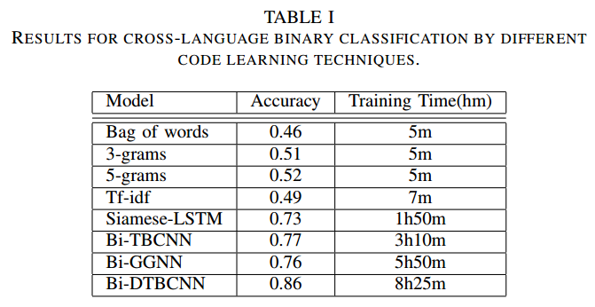
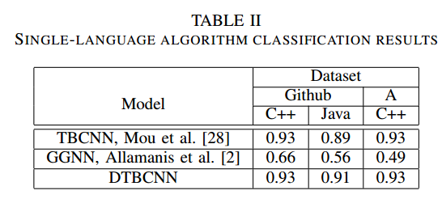
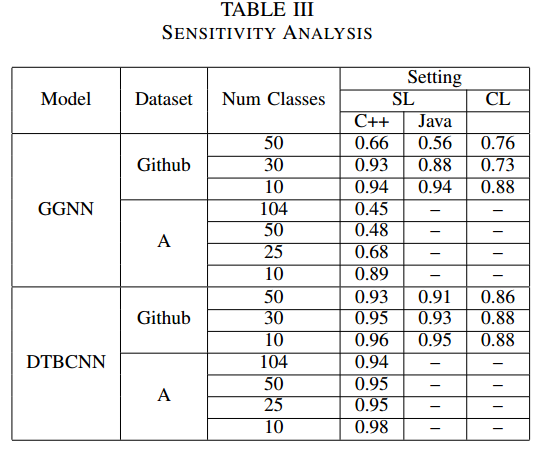

Materials for Saner'2019
===============

## Overview
- Bi-DTBCNN and D-TBCNN code in Tensorflow : /model
- Baseline code : /baselines
  - n-gram
  - bow
  - tf-idf
  - siamese-lstm
  - gated graph neural networks
- Data: /data
  - Raw data : /data/code
  - Protobuf : /data/code_pb_slice
  - Pickle :   /data/code_pb_slice_pkl
- Labels of algorithsm : miscellaneous/algorithms.txt
Since the training data is quite large, we store in on Google Drive.

Download the pretrained embedding, training data and testing data here: https://drive.google.com/open?id=1aA-l31EwaDETdBtFFZ2EXLYkN0Z6zKgT and the raw Github Data here https://drive.google.com/open?id=103Ij5KIyL23dHXr0sCj_iNW473cMgupq and store into the directory pretrained_embedding/

We use Python with Tensorflow, keras, sklearn to build the model and run the baselines.

## Results

- In Table 1, we prove that the performance of Bi-DTBCNN outperforms the other baselines in the cross-language binary classification.
- In Table 2, we prove that the performance of DTBCNN outperforms the other baselines in the single language classification.
- In Table 3, we perform an sensitivity analysis to see how different Bi-NNs is affected when number of classes increases. We can see that Bi-DTBCNN can keep up the performance whislt Bi-GGNN decreases significantly.
- In Table 4, we show that different dependency tree can affect the performance significantly.

   
   
   
   

## Process

To give an overview of how we process our data, here are the steps:
- Use nicad clone detection tool : https://www.txl.ca/ to remove clones.
- Once the clones are removed, we use the parser from http://www.srcml.org/ to parse the code into Protobuf format.
- From the protobuf format, we dump it into the Python pickle format for training, since our code based is written in Python, from now all, all of the training is based on the pickle files.

